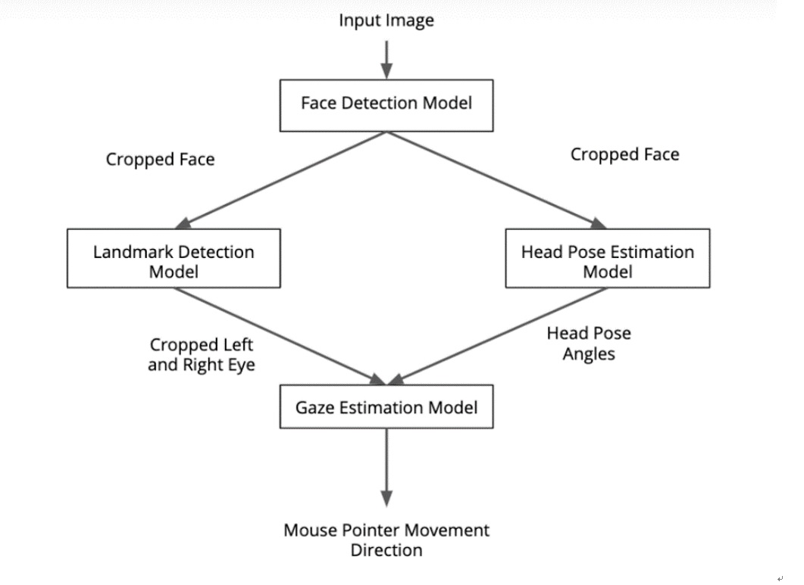
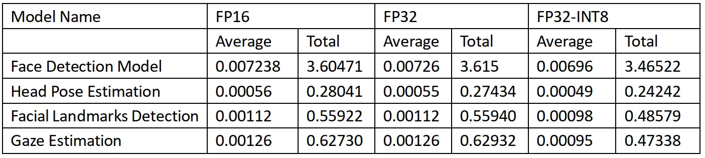

## Computer Pointer Controller

CPC is an AI app which is used to control mouse pointer. In this app mouse pointer is controlled using head position and movement of eyes. Four intel edge AI models 
were used in creation of this app, and it was created using Intel OpenVino Toolkit. Input to this app can be a video file or live feed using webcam. The first model 
(Face detection model) detects the head in the video, this detection is then used as input to second (Landmarks regression model) and third model (Head Pose 
Estimation model), the second model detects the eyes on face and third model detects the orientation of head, output of second and third model is used as input to 
last model (Gaze estimation model) which estimates the coordinates of where person is looking, these coordinates are used as input to move mouse pointer using 
pyautogui library.

## Directory Structure
---ComputerPointerController
	
	|---main.py
	
	|---mouse_controller.py
	
	|---face_detection.py
	
	|---facial_landmark_detection.py
	
	|---head_pose_estimation.py
	
	|---gaze_estimation.py
	
	|---demo.mp4
	
	|---README.md
	
	|---models
			
		|---face-detection-adas-binary-0001.bin
			
		|---face-detection-adas-binary-0001.xml
		
		|---landmarks-regression-retail-0009bin
		
		|---landmarks-regression-retail-0009.xml
			
		|---head-pose-estimation-adas-0001.bin
			
		|---head-pose-estimation-adas-0001.xml
			
		|---gaze-estimation-adas-0002.bin
			
		|---gaze-estimation-adas-0002.xml

All the code files are in main directory and required models are downloaded in models directory inside main directory, for this projec we need four models from OpenVino 
pre-trained models liberary, for simplicity only FP32 models are included here so if you want to try others you can download them from link mentioned below
1) Face detection model, to detect face in video, download link 
	https://docs.openvinotoolkit.org/latest/_models_intel_face_detection_adas_binary_0001_description_face_detection_adas_binary_0001.html
2) Landmarks regression model to detect left nad right eye.
	https://docs.openvinotoolkit.org/latest/_models_intel_head_pose_estimation_adas_0001_description_head_pose_estimation_adas_0001.html
3) Head Pose Estimation model to estimate position of head
	https://docs.openvinotoolkit.org/latest/_models_intel_landmarks_regression_retail_0009_description_landmarks_regression_retail_0009.html
4) Gaze estimation model, to estimate location where eyes are looking.
	https://docs.openvinotoolkit.org/latest/_models_intel_gaze_estimation_adas_0002_description_gaze_estimation_adas_0002.html
  This Project was created in Ubuntu, In order for this project to work we will need to install 
1) Intel OpenVino toolkit, link to download toolkit is given below
	https://software.intel.com/content/www/us/en/develop/tools/openvino-toolkit/choose-download.html
2) OpenCV which can be installed using command
	$ sudo apt-get install python-opencv
3) numpy which can be installed using command
	$ sudo apt install python-numpy

## Demo
In order to run basic demo, you will need to run the command

	$ python main.py -m1 models/face-detection-adas-binary-0001 -m2 models/landmarks-regression-retail-0009 -m3 models/head-pose-estimation-adas-0001 -m4 models/gaze-estimation-adas-0002 -i demo.avi

Here main.py is main python file while demo.mp4 is video input, in order to use webcam instead of video file, command will be

 	$ python main.py -m1 models/face-detection-adas-binary-0001 -m2 models/landmarks-regression-retail-0009 -m3 models/head-pose-estimation-adas-0001 -m4 models/gaze-estimation-adas-0002 -i CAM

There are eight command line arguments for this program.
1) -m1		Path to FaceDetection model
2) -m2		Path to LandmarksDetection model
3) -m3		Path to HeadPoseEstimation model
4) -m4		Path to GazeEstimation model
5) -i 		Path to video file or webcam feed (0)
6) -d 		Specify the target device to infer on (CPU, GPU, VPU, FPGA)
7) -o 		Output file for storing stats
8) -pt 		Probability threshold for face detections filtering
9) -fdv 		FaceDetection visualization
10) -lmv 		LandmarksDetection visualization
11) -hpv 	HeadPoseEstimation visualization
 
## Documentation

Model Documentations are available at 

1)	Face Detection Model 
(https://docs.openvinotoolkit.org/latest/_models_intel_face_detection_adas_binary_0001_description_face_detection_adas_binary_0001.html)
2)	Head Pose Estimation
(https://docs.openvinotoolkit.org/latest/_models_intel_head_pose_estimation_adas_0001_description_head_pose_estimation_adas_0001.html)
3)	Facial Landmarks Detection
(https://docs.openvinotoolkit.org/latest/_models_intel_landmarks_regression_retail_0009_description_landmarks_regression_retail_0009.html)
4)	Gaze Estimation 
(https://docs.openvinotoolkit.org/latest/_models_intel_gaze_estimation_adas_0002_description_gaze_estimation_adas_0002.html)

## Benchmarks

Benchmark results obtained using Intel Core i7-9750H CPU

### Model Loading Time:

Model Name	|	FP16 (sec.)	|	FP32 (sec.)	|	FP32-INT8 (sec.)
----------	|	-----------	|	----------	|	----------------
Face Detection Model	|	0.245	|	0.242	|	0.247
Head Pose Estimation	|	0.148	|	0.138	|	0.159
Facial Landmarks Detection	|	0.151	|	0.137	|	0.193
Gaze Estimation		|0.188	|	0.164	|	0.232
Total Time	|	0.732	|	0.681	|	0.831

### Model Inference Time:

### FPS:

Model Name	|	FP16	|	FP32	|	FP32-INT8
----------	|	----	|	----	|	---------
Face Detection Model	|	138.15	|	137.76	|	143.71
Head Pose Estimation	|	1775.94	|	1815.23	|	2054.24
Facial Landmarks Detection	|	890.53	|	890.23	|	1025.14
Gaze Estimation	|	793.88	|	791.32	|	1052.00

## Results:
From tables above it is clear that in my case FP32-INT8 is giving best results compared to FP32 and FP16, the total inference time for FP32-INT8 is lower than FP16 and FP32 while FPS are high.
