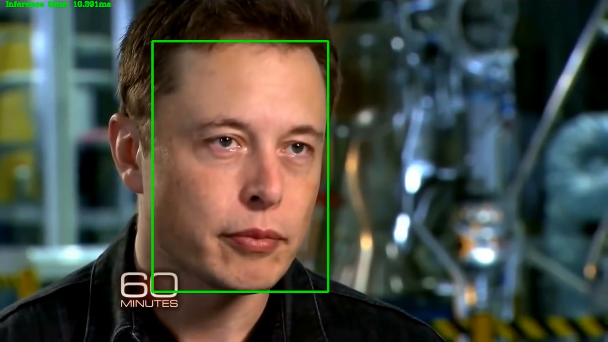

Face Detection using Intel OpenVino Toolkit. The code is written in Python and it uses Intel's OpenVINO toolkit to perform inference on input (Video/image).

## Directory Structure

---Directory structure

    |---main.py
    
    |---Inference.py
    
    |---vid8.mp4
    
    |---output.mp4
    
    |---1.jpg
    
    |---output_image.jpg
    
    |---preview.jpg
    
    |---README.md
    
    |---models
    
      |---face-detection-retail-0005.bin
      
      |---face-detection-retail-0005.xml

All the code files are in main directory and required models are downloaded in models directory inside main directory, for this projec we need one model from OpenVino pre-trained models liberary.

Face detection model, to detect face in video, download link
https://docs.openvinotoolkit.org/2019_R2/_intel_models_face_detection_retail_0005_description_face_detection_retail_0005.html

## Demo

In order to run basic demo, you will need to run the command

For image input 

python main.py --model face-detection-retail-0005.xml --input 1.jpg

for Video/webcam input

python main.py --model face-detection-retail-0005.xml --input vid1.mp4

There are five command line arguments for this program.

-m Path to FaceDetection model

-i Path to input image or video file or webcam feed (0)

-l Path to CPU extension file (Not needed in new version of OpenVino toolkit)

-d Specify the target device to infer on (CPU, GPU, VPU, FPGA)

-pt Probability threshold for face detections filtering

## Output Video

Click the image below to view the output video

