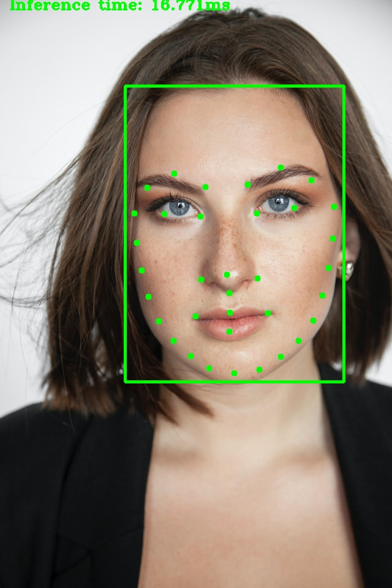

Facial Landmarks Detection using Intel OpenVino Toolkit. The code is written in Python and it uses Intel's OpenVINO toolkit to perform inference on input (Video/image). In this implementation first we detect Face in an image/video using Face Detection model of Intel's OpenVINO toolkit and output from this Face Detection model is used as input to Facial Landmarks Detection model.

## Directory Structure

---Directory structure

    |---main.py
    
    |---Inference.py
    
    |---vid9.mp4
    
    |---output.mp4
    
    |---3.jpg
    
    |---output_image.jpg
    
    |---README.md
    
    |---models
    
      |---face-detection-retail-0005.bin
      
      |---face-detection-retail-0005.xml
      
      |---facial-landmarks-35-adas-0002.bin
      
      |---facial-landmarks-35-adas-0002.xml

All the code files are in main directory and required models are downloaded in models directory inside main directory, for this projec we need one model from OpenVino pre-trained models liberary.

Face detection model, to detect face in video/image, download link
https://docs.openvinotoolkit.org/2019_R2/_intel_models_face_detection_retail_0005_description_face_detection_retail_0005.html

Facial Landmarks detection model, to detect facial landmarks in video/image, download link
https://docs.openvinotoolkit.org/latest/omz_models_intel_facial_landmarks_35_adas_0002_description_facial_landmarks_35_adas_0002.html

## Demo

In order to run basic demo, you will need to run the command

For image input 

    $ python3 main.py --model1 model/face-detection-retail-0005.xml --model2 model/facial-landmarks-35-adas-0002.xml --input 3.jpg

for Video/webcam input

    $ python3 main.py --model1 model/face-detection-retail-0005.xml --model2 model/facial-landmarks-35-adas-0002.xml --input vid9.mp4

There are five command line arguments for this program.

1)  -m1 Path to FaceDetection model

2)  -m2 Path to FacialLandmarksDetection model

3)  -i Path to input image or video file or webcam feed (0)

4)  -d Specify the target device to infer on (CPU, GPU, VPU, FPGA)

5)  -pt Probability threshold for face detections filtering

## Output Video

Click the image below to view the output video

